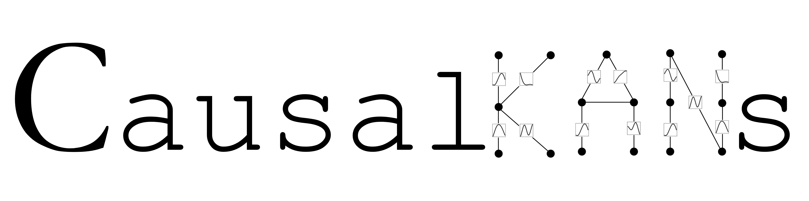

# CausalKANS: Interpretable Treatment Effect Estimation with Kolmogorov-Arnold Networks

CausalKANs is a Python library for interpretable estimation of treatment effects using Kolmogorov-Arnold networks. It provides reproducible experiments, visualization tools, and symbolic analysis for causal inference research.

---

## Key Features
- Interpretable causal inference with Kolmogorov-Arnold networks (KANs)
- Reproducible experiments for benchmark datasets (ACIC, IHDP)
- Visualization notebooks for interpretability and results
- Symbolic analysis and representation tools
- Modular code for easy extension and experimentation

---

## Getting Started

1. Install dependencies:
   ```bash
   pip install -r requirements.txt
   ```
   (Use Python 3.10)

   Note: `tueplots` is only used for plot styling. You may remove it, but will need to adjust plot styles in the code.

---

## Project Structure
- `hp_search/` — Hyperparameter search scripts
- `notebooks/` — Visualization and interpretability notebooks
- `models/` — KAN and MLP model implementations
- `utils/` — Representation, symbolic, and results utilities
- `datasets/` — Benchmark datasets (ACIC, IHDP)

All folders are located in the root directory of the project.

---

## Usage

### 1. Replicate Experiments
- Run hyperparameter search scripts:
  - `hp_search/experiment_search_kan.py`
  - `hp_search/experiment_search_mlp.py`
- Extract metrics for Table 1, Table 3, and Table 4.
- Ablation studies of appendix C.1 can be found in `hp_search/ablation_studies/`.

### 2. Visualization & Interpretability
- Use notebooks for results and interpretability:
  - `notebooks/visualization_acic_tkaam.ipynb` (ACIC-7, T-KAAM)
  - `notebooks/visualization_ihdp_slearner.ipynb` (IHDP A, S-KAAM)
  - `notebooks/visualization_other_datasets.ipynb` (IHDP B, ACIC-2, DragonKAAM)
  - Table 2 is extracted from these notebooks. Also equations and visualizations of section 5.2 and Appendix C.

### 3. Utilities & Models
- Representation tools: `utils/utils_representation.py`
- Symbolic substitution: `utils/utils_symbolic.py`
- Results utilities: `utils/utils_results.py`
- Models:
  - `models/kan_model.py` (causalKAN)
  - `models/mlp_model.py` (causalNN)

---

## How to Cite
If you use causalKANs in your research, please cite:

```bibtex
@article{almodovar2025causalkans,
  title={CausalKANs: interpretable treatment effect estimation with Kolmogorov-Arnold networks},
  author={Almod{\'o}var, Alejandro and Apell{\'a}niz, Patricia A and Zazo, Santiago and Parras, Juan},
  journal={arXiv preprint arXiv:2509.22467},
  year={2025}
}
```

---

For questions or contributions, feel free to open an issue or pull request.
Contact: `alejandro.almodovar@upm.es`
